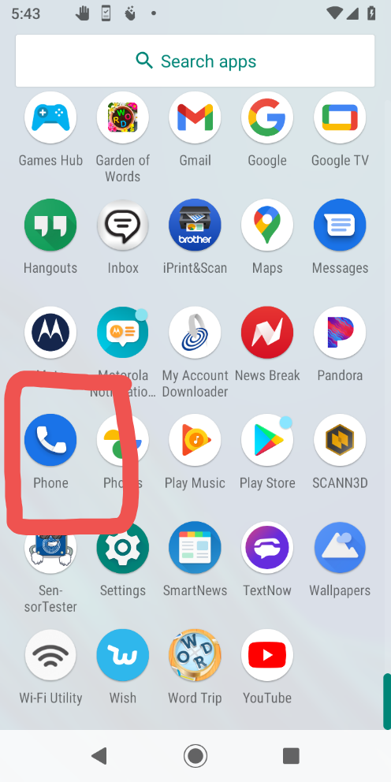
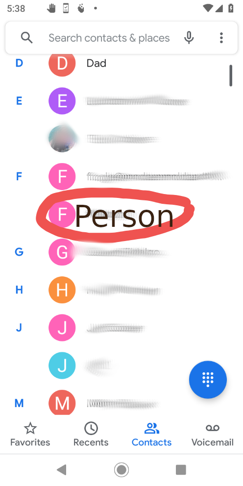
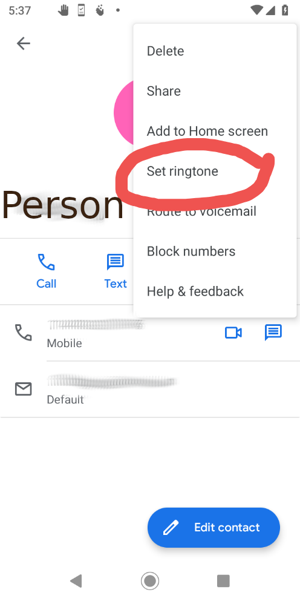

<b>Ringtone installing for smartphones instructions </b>
 1) Setting the ringtone for every single incoming call
 
Go to your setting page on your smartphone then go to sound/audio setting should look similar to the below screenshot process.
 
 

  
  
  
  
  
 

 Once you searched and found your ringtone your done!!!
  
 Remember before any of these steps to actually copy or download your new ringtone to your phone in the first place :)
  
 
2) Setting the ringtone for individual contacts/numbers
  

  
  
  
 

Then just add a ringtone or select a ringtone as usual similar to method 1) from here on out!
  
Congradulations you now know how to install ringtones on your phone. 
With a little more investigating you see that you can also set alarm ringtones , notification ringtones , and different audio clips for different sound affect on your phone as well.
 
 PLEASE CHECKOUT MY RINGTONE FOLDER NOW AND AGAIN FOR COOL NEW RINGTONES YOU CAN INSTALL!!!
